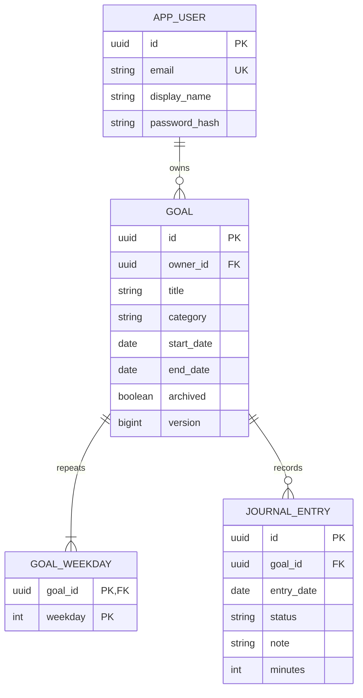

# 설계 및 원본 프로젝트 참고 사항

## 원본 확인과 변경 방향

참고 저장소: [jooyoungyun/jaksimProject](https://github.com/jooyoungyun/jaksimProject). 분석 기준은 실제 Vue 소스가 있는 `master` 브랜치의 커밋 `1a0adc5c49074fe487e2eae7567c5541a2189fb3`입니다.

| 원본에서 확인한 사항 | Resolve Log 구성 |
| --- | --- |
| `main`, `dev`에는 실질적인 앱 소스가 없음 | `master/jaksim-front`의 화면·흐름을 참고 |
| Vue 3 + JavaScript + Vue CLI | Nuxt 4 + Vue 3 + TypeScript로 신규 작성 |
| 결심 목록·작성·수행 기록 중심 화면 | 개인 결심 관리와 날짜별 일지로 재구성 |
| `jaksim-back`은 gitlink이며 연결 정보·서버 소스를 확인할 수 없음 | Java/Spring Boot/JPA API와 DB 스키마를 신규 구현 |
| 이름·라우팅·데이터 연결을 다시 정리할 필요 | 브랜드 `Resolve Log`, 폴더 `resolve-log`, API 패키지 `com.resolvelog` |

원본의 동작을 그대로 이식한 것이 아니라, 결심과 일지라는 요구사항을 기준으로 재설계한 프로젝트입니다. 공개 커뮤니티·좋아요·사진 업로드·SNS 로그인은 이번 개인 일지 범위에 포함하지 않았습니다.

## 실행 구조

브라우저가 Nuxt의 `/api/**`로 요청하면 Nitro 서버가 Spring Boot로 전달합니다. 로컬은 `127.0.0.1:8080`, Docker 내부는 `backend:8080`을 사용합니다. 이 서버 주소는 브라우저 번들에 노출하거나 고정하지 않습니다. JPA 트랜잭션은 Spring 서비스 계층에서 처리하고, Flyway가 DB 스키마를 관리합니다.

| 모듈 | 책임 |
| --- | --- |
| `auth` | 회원가입, 비밀번호 검증, JWT 발급·검증, 내 정보 |
| `goal` | 소유자별 결심·일정·보관 상태 관리 |
| `journal` | 날짜별 수행 기록, 조회, 대시보드·달력 집계 |
| `common` | 시간대·Clock, 공통 오류 응답 |

## 데이터 관계



`journal_entry(goal_id, entry_date)`는 복합 유일 키입니다. 결심 삭제 시 반복 요일과 일지를 DB 외래 키의 `ON DELETE CASCADE`로 삭제합니다. 기간·카테고리·상태·실천 시간에는 DB 제약도 적용합니다. 상세 DDL은 `backend/src/main/resources/db/migration/V1__initial_schema.sql`에 있습니다. 이미 적용된 V1을 수정하지 말고 V2부터 새 마이그레이션을 추가합니다.

## 일지 정책

1. 날짜 기준은 `APP_TIMEZONE`이며 기본 `Asia/Seoul`입니다. 날짜는 `YYYY-MM-DD`, 시각은 UTC 기반 `Instant`로 처리합니다.
2. 반복 요일은 ISO 기준 월요일 1부터 일요일 7까지입니다. 한 개 이상 선택하며 중복을 허용하지 않습니다.
3. 새로운 일지는 결심 기간·반복 요일에 속하고, 오늘 이전 또는 오늘이며, 보관되지 않은 결심에만 추가할 수 있습니다.
4. 기존 일지는 결심을 보관하거나 반복 요일을 변경해도 조회·수정할 수 있습니다. 이미 있는 기록을 기간 밖으로 밀어내는 시작일·종료일 변경은 거부합니다.
5. 하루에 여러 번 저장하면 같은 일지를 수정합니다. 결심 행에 쓰기 잠금을 잡아 동시 요청을 직렬화하고, DB 유일 키로 중복을 방지합니다. 메모 동시 수정은 나중에 저장한 내용이 반영됩니다.
6. 결심 수정은 `version`을 확인합니다. 이전 화면에서 보낸 오래된 버전은 409를 반환하므로 새로고침 후 다시 수정합니다.
7. 대시보드의 대상은 선택한 날의 예정된 결심과 해당 날짜에 기존 일지가 있는 결심의 합집합입니다. 달성률은 그 대상 중 `DONE` 비율을 반올림한 정수입니다. `PARTIAL`, `SKIPPED`는 완료 수에 포함하지 않습니다.
8. 보관함의 달력은 해당 월 전체 결심을 집계합니다. 옆 일지 목록의 결심·상태 필터는 달력 집계에 영향을 주지 않습니다.

## API 계약

기본 경로는 `/api`, JSON을 사용합니다. 회원가입·로그인을 제외한 API는 `Authorization: Bearer <accessToken>`이 필요합니다. 사용자 ID는 요청 본문에서 받지 않고 검증된 JWT의 `sub`에서 가져옵니다. 다른 사용자의 결심 ID로 접근하면 404를 반환합니다.

| 메서드 | 경로 | 내용·성공 상태 |
| --- | --- | --- |
| POST | `/auth/register` | 가입 후 토큰·사용자 반환, 201 |
| POST | `/auth/login` | 로그인 후 토큰·사용자 반환, 200 |
| GET | `/auth/me` | 현재 사용자, 200 |
| GET | `/goals` | 보관 포함 내 결심 목록, 200 |
| POST | `/goals` | 결심 생성, 201 |
| GET | `/goals/{id}` | 결심 조회, 200 |
| PUT | `/goals/{id}` | 전체 필드·현재 version으로 수정, 200 |
| DELETE | `/goals/{id}` | 결심과 관련 일지 삭제, 204 |
| PUT | `/goals/{id}/entries/{date}` | 일지 생성 또는 수정, 200 |
| DELETE | `/goals/{id}/entries/{date}` | 해당 일지 삭제, 없는 일지도 204 |
| GET | `/entries` | from·to 필수; goalId·status·page·size 선택, 200 |
| GET | `/dashboard?date=YYYY-MM-DD` | 날짜 생략 시 오늘, 200 |
| GET | `/calendar?month=YYYY-MM` | 월간 일별 집계, 200 |

직접 호출 예제는 [requests.http](requests.http)를 위에서부터 실행합니다.

결심 입력:

```json
{
  "title": "하루 30분 산책",
  "reason": "나를 돌보는 시간을 만들기",
  "category": "HEALTH",
  "startDate": "2026-09-15",
  "endDate": null,
  "weekdays": [1, 2, 3, 4, 5, 6, 7],
  "archived": false
}
```

수정 시에는 최신 조회 응답의 `version`을 추가합니다. 카테고리는 `HEALTH`, `STUDY`, `WORK`, `LIFE`, `FINANCE`, `OTHER`입니다.

일지 입력:

```json
{"status":"DONE","note":"공원을 걷고 생각을 정리했다.","minutes":30}
```

상태는 `DONE`, `PARTIAL`, `SKIPPED`입니다. 메모는 최대 4,000자, 실천 시간은 0~1,440분입니다. 조회 기간은 양 끝 포함 최대 367일, 페이지는 1부터 시작하고 기본 크기는 20, 최대 크기는 100입니다.

오류 형식:

```json
{"code":"VALIDATION_ERROR","message":"입력값을 확인해 주세요.","fieldErrors":{"title":"공백일 수 없습니다"}}
```

필드 검증 문구는 서버 로케일에 따라 달라질 수 있습니다. HTTP 상태는 400(잘못된 입력·일정), 401(인증 실패·만료), 403(접근 금지), 404(없거나 다른 사용자 소유), 409(중복·버전 충돌)를 사용합니다.

## 인증과 구현 범위

비밀번호는 BCrypt로 저장합니다. 가입 시 8~64자이며 BCrypt 한도인 UTF-8 72바이트도 확인합니다. 이메일은 소문자로 정규화합니다. JWT는 HS256, issuer `resolve-log`, audience `resolve-log-web`, 기본 유효기간 8시간입니다.

프런트는 토큰을 localStorage에 보관하고 Authorization 헤더로 전달합니다. 인증 쿠키·서버 세션을 사용하지 않으며, 401 발생 시 다시 로그인합니다. 로그아웃은 해당 브라우저의 토큰을 지웁니다. 토큰 강제 폐기·자동 갱신·이메일 인증·비밀번호 재설정은 구현 범위에 포함하지 않았습니다. 운영 인증 정책이 필요해지면 이 부분을 확장하세요.

개발 환경의 DB 비밀번호·JWT 키는 예제 값입니다. Docker 기본 포트 바인딩은 `127.0.0.1`이며 원격 공개 배포를 위한 도메인·TLS 프록시는 포함하지 않습니다.
